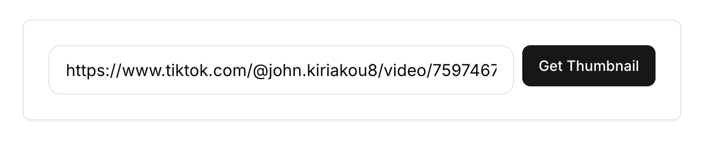
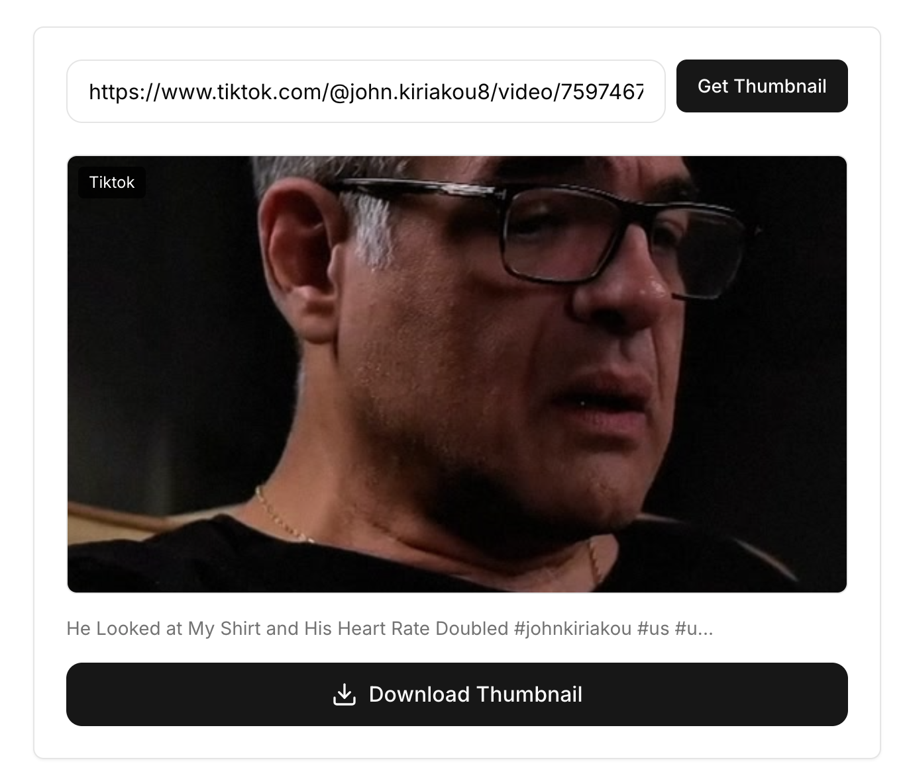

Çarpıcı bir küçük resim, bir TikTok videosunun viral olmasını sağlayabilir, ancak platform bu kapak görselini kaydetmek için basit bir yol sunmaz. İster bir içerik oluşturucu, ister bir sosyal medya yöneticisi olun, ister sadece harika bir tasarımı arşivlemek isteyin, o yüksek kaliteli görseli almanın bir yoluna ihtiyacınız var.

Ekran üstü metin ve simgelerle dolu bulanık ekran görüntülerini unutun. Bu rehber, herhangi bir videodan orijinal, yüksek çözünürlüklü kapak görselini kaydetmek için **ücretsiz bir TikTok küçük resim indiricisini** nasıl kullanacağınızı gösterecek.

### İçindekiler
- [Neden Yüksek Kaliteli Bir TikTok Küçük Resmi Çok Önemli?](#why-crucial)
- [Herhangi Bir TikTok Küçük Resmini 3 Basit Adımda Nasıl İndirirsiniz?](#how-to-download)
- [Ekran Görüntüleri Neden İşe Yaramaz (Ve Bunun Yerine Ne Yapmalısınız)?](#why-screenshots-fail)
- [İndirilen TikTok Küçük Resimlerini Kullanmanın 3 Akıllı Yolu](#smart-ways)
- [Sıkça Sorulan Sorular (SSS)](#faq)

---

## Neden Yüksek Kaliteli Bir TikTok Küçük Resmi Çok Önemli?

Bir küçük resim, videonuzun ilk izlenimidir. Temiz, HD bir sürüm, içerik stratejiniz için değerli bir varlıktır. İşte içerik oluşturucuların ve pazarlamacıların onları neden indirdiği:

- **İçeriği Yeniden Kullanma:** TikTok videolarınızı **YouTube Shorts, Instagram Reels veya Pinterest** gibi platformlarda yeniden paylaşıyorsanız, bu platformlarda izleyicileri çekmek için yüksek kaliteli bir küçük resme ihtiyacınız vardır. Bir ekran görüntüsü yeterli olmayacaktır.
- **Tasarım İlhamı:** Viral videolardan küçük resimleri kaydederek bir "ilham dosyası" oluşturun. Metin yerleşiminden renk şemalarına, yüz ifadelerine kadar neyin işe yaradığını analiz ederek kendi yaratıcı stratejinizi geliştirin.
- **Tutarlı Markalaşma:** Videonuzu paylaştığınız her yerde aynı yüksek kaliteli kapak görselini kullanarak tüm sosyal medya platformlarında markanızın tutarlı olmasını sağlayın.
- **Arşivleme:** Portföyünüz veya gelecekteki referanslarınız için en iyi performans gösteren video kapaklarınızın yüksek çözünürlüklü bir arşivini tutun.

## Herhangi Bir TikTok Küçük Resmini 3 Basit Adımda Nasıl İndirirsiniz?

Bu süreci anında ve kolay hale getirmek için [Küçük Resim Yakalayıcı](/tr/thumbnail-grabber/) aracımızı geliştirdik.

### Adım 1: TikTok Video Bağlantısını Kopyalayın
TikTok uygulamasını veya web sitesini açın, istediğiniz videoyu bulun ve **Paylaş** düğmesine dokunun. Ardından, **Bağlantıyı Kopyala**'yı seçin.

### Adım 2: Bağlantıyı İndiriciye Yapıştırın
[MediaTools Küçük Resim Yakalayıcı](/tr/thumbnail-grabber/) sayfasına gidin. Kopyaladığınız URL'yi giriş kutusuna yapıştırın.

### Adım 3: HD Küçük Resmi İndirin
**"Küçük Resmi Al"** düğmesine tıklayın. Araç, kapak görselini mevcut tüm çözünürlüklerde anında çıkaracaktır. En iyi kalite için her zaman **Maks / HD** seçeneğini belirleyin ve **İndir**'e tıklayın.

Artık temiz, orijinal küçük resim, filigran veya dikkat dağıtıcı kullanıcı arayüzü öğeleri olmadan doğrudan cihazınıza kaydedilmiştir.

## Ekran Görüntüleri Neden İşe Yaramaz (Ve Bunun Yerine Ne Yapmalısınız)?

Videoyu duraklatıp ekran görüntüsü almak cazip gelebilir. Bu, birkaç nedenden dolayı kötü bir fikirdir:

- **Düşük Çözünürlük:** Bir ekran görüntüsü, ekranınızın çözünürlüğüyle sınırlıdır ve bu genellikle orijinal küçük resmin kalitesinden çok daha düşüktür. Bu, bulanık, profesyonel olmayan bir görüntüyle sonuçlanır.
- **Kullanıcı Arayüzüyle Dolu:** Ekran görüntüleri, ekrandaki her şeyi yakalar; oynatma düğmesi, kullanıcı adı, altyazılar ve beğenme/yorum yapma simgeleri gibi. Bunları kaldırmak zahmetli düzenleme gerektirir.
- **Yanlış Boyutlar:** Telefonunuzun durum çubuğunu ve diğer alakasız kısımları kaldırmak için görüntüyü manuel olarak kırpmanız gerekir, bu da zaman alıcı olabilir.

**Çözüm:** Bizimki gibi özel bir **TikTok küçük resim yakalayıcı**, tertemiz görüntü dosyasını doğrudan TikTok sunucularından çıkarır. Bu, ekranda herhangi bir dağınıklık olmadan mümkün olan en yüksek kaliteyi elde etmenizi sağlar.

## İndirilen TikTok Küçük Resimlerini Kullanmanın 3 Akıllı Yolu

1.  **Özel YouTube Küçük Resimleri Oluşturun:** Bir TikTok derlemesini veya tek bir kısa videoyu YouTube'a yüklerken, indirilen HD kapağı YouTube küçük resminizin temeli olarak kullanın. Yeni platform için optimize etmek amacıyla metin veya marka öğeleri ekleyin.
2.  **Sosyal Paylaşımı İyileştirin:** Twitter gibi platformlarda veya bir bülten içinde bir bağlantı paylaştığınızda, genellikle düşük kaliteli, kötü kırpılmış bir önizleme çekerler. Gönderinizin profesyonel görünmesini ve daha fazla tıklama almasını sağlamak için indirilen küçük resmi manuel olarak yükleyin.
3.  **Rakip Stratejisini Analiz Edin:** Nişinizdeki en iyi performans gösteren videolardan küçük resimleri indirin. Kendi içeriğiniz için uyarlayabileceğiniz tasarım, renk ve stil trendlerini belirlemek için bunları inceleyin.

## Sıkça Sorulan Sorular (SSS)

**Başkasının TikTok küçük resmini indirmek yasal mı?**
Teknik olarak mümkün olsa da, **telif hakkına** dikkat edin. Başkasının görselini kendi ticari içeriğiniz için izinsiz kullanmak telif hakkı iddialarına yol açabilir. İndirilen küçük resimleri kişisel referans, ilham veya *kendi* içeriğinizi yeniden kullanmak amacıyla kullanmanızı öneririz.

**Bu araç mobil ve masaüstünde çalışıyor mu?**
Evet! Aracımız web tabanlıdır ve iPhone, Android, Windows ve Mac dahil olmak üzere tarayıcısı olan herhangi bir cihazda çalışır.

**Özel videolardan küçük resim indirebilir miyim?**
Hayır. Aracımız yalnızca TikTok'ta herkese açık olan içeriğe erişebilir.

**Alabileceğim en yüksek çözünürlük nedir?**
Araç, TikTok'un sunduğu en yüksek çözünürlüğü çıkarır, bu genellikle HD kalitesindedir. Tam boyutlar orijinal yüklemeye bağlı olarak değişebilir.

**Bu araç gerçekten ücretsiz mi?**
Evet, MediaTools Küçük Resim Yakalayıcı %100 ücretsiz ve sınırsızdır. Gizli ücret veya kayıt gereksinimi yoktur.

## Küçük Resimleri Bugün İndirmeye Başlayın

Bulanık, dağınık ekran görüntüleriyle yetinmeyi bırakın. Herhangi bir TikTok videosu için orijinal, yüksek kaliteli küçük resmi kullanarak içerik stratejinizi yükseltin.

**[Ücretsiz TikTok Küçük Resim İndiricimizi Şimdi Deneyin](/tr/thumbnail-grabber/)**

---

**İlgili MediaTools Araçları:**
- [TikTok Video İndirici](/tr/tiktok-downloader/)
- [TikTok Ses İndirici](/tr/tiktok-sound-downloader/)
- [YouTube Küçük Resim Yakalayıcı](/tr/thumbnail-grabber/)